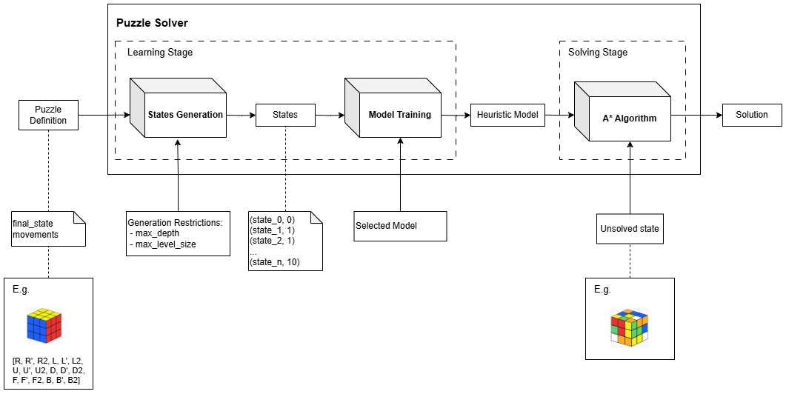
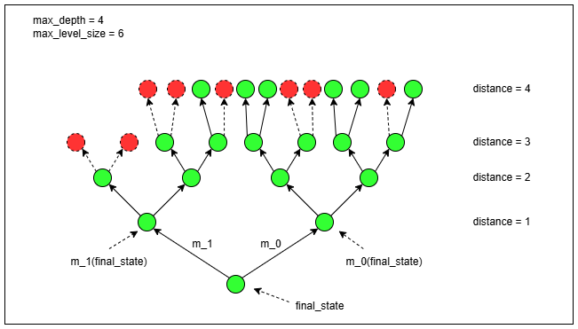
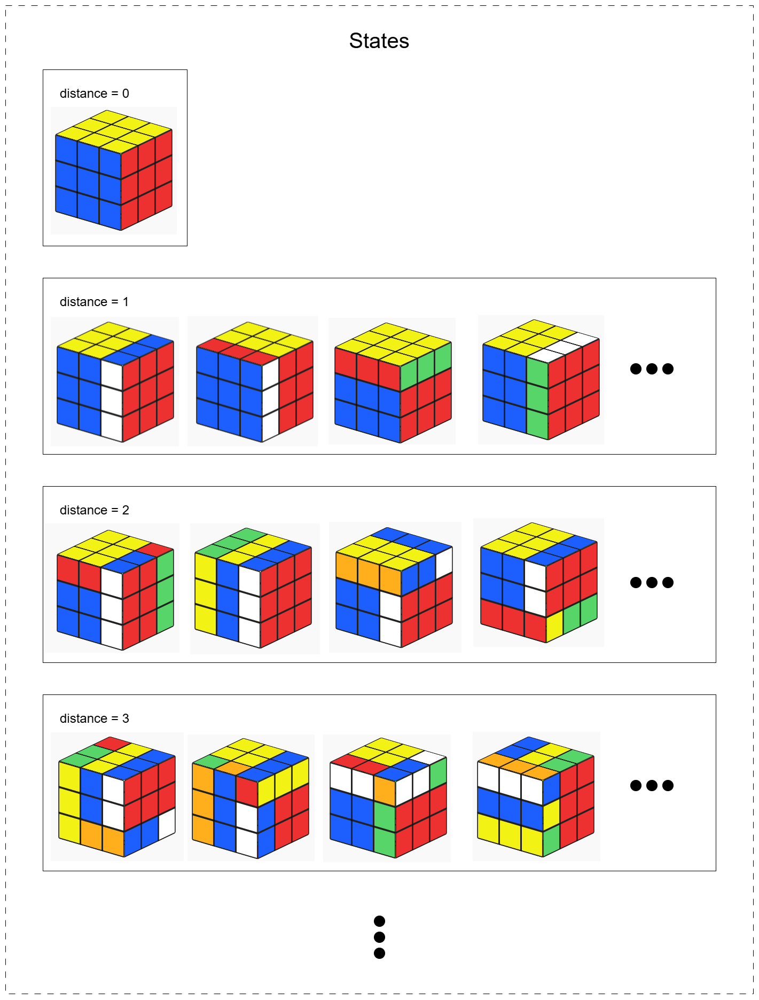
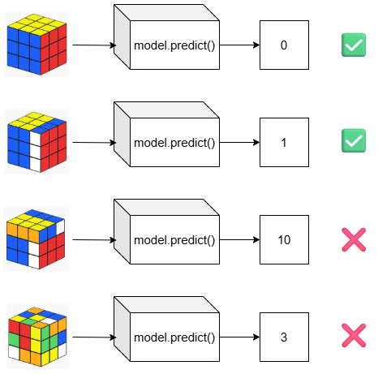
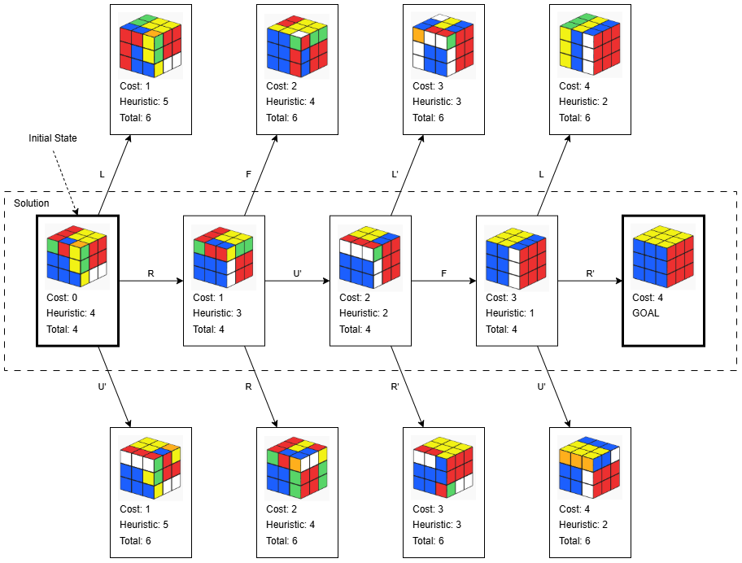
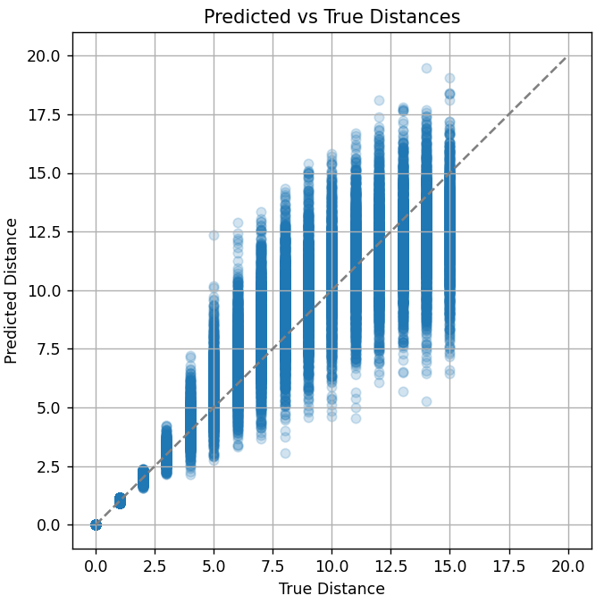

> ⚠️ **Work in Progress**  
> This project is still under active development. Some features may be incomplete or non-functional, and the documentation may not reflect the most recent changes.

---

# Heuristic Model A* Puzzle Solver

A machine learning–augmented puzzle solver that learns how to solve any puzzle (within defined constraints) by exploring the puzzle's state-space knowing only the final state and the available movements.

---

## 🧩 Overview

This project presents an **experimental puzzle solver** that combines machine learning and A* search to solve puzzles with minimal prior knowledge of the puzzle mechanics.

The key idea is for the Puzzle Solver to learn by exploring any puzzle's state-space, starting from the known final state and using only the available set of valid movements. Then, the understanding gained through state-space exploration will be used alongside the A* search algorithm to solve new, unseen configurations.

---

## 🚦 Supported Puzzle Requirements

To be solvable by this system, a puzzle must satisfy the following constraints:

* ✅ A single, unique final (solved) state.
* ✅ A finite and known set of valid movements.
* ✅ Each movement must be **reversible**, i.e., for every move `m` there exists an inverse `m'` such that: `m'(m(s)) = s`

---

## ⚙️ How It Works
The Puzzle Solver architecture can be divided into two stages: the Learning Stage and the Solving Stage. The first step in the Learning Stage is the States Generation, where the Puzzle Solver takes as input the Puzzle definition (final state and valid movements) and some generation restrictions (max depth and max level size). Then it starts exploring the state-space starting from the final state and moving level by level with the available movements (level = distance to the final state), the output is a list of pairs (state, distance_to_final_state). Next, the second step in the Learning Stage is the Model Training, here a Machine Learning Model is trained to predict the distance of any unsolved state to the final state. Finally, in the Solving Stage, the trained Model is used as a heuristic in the A* alogrithm to efficiently find solutions to any unsolved state.

Throughout the documentation, the Rubik's Cube will be used as example, but all steps can be adapted to different puzzles. Rubik's Cube images generated with https://rubiks-cube-solver.com/.




### 1. State Generation
Starting from the final (solved) state, the system generates a subset of all the valid states by applying all valid moves to each known state, keeping track of how many steps away each state is from the goal. The output is a list of pairs (state, distance). Along with the puzzle definition (containing the final state and valid movements) some generation restrictions are used as input to restrict the state-space exploration, which is indispensable when learning to solve puzzles that have a very large amount of possible states, like the Rubik's Cube. These restrictions are max_depth and max_level_size. max_depth defines how far from the final state should the Puzzle Solver explore and max_level_size defines how many states should be explored for each level.

The next image illustrates the State Generation process for a generic puzzle with a given final_state, \[m_0, m_1\] as the available movements, max_depth = 4 and max_level_size = 6.



Notice that in level 3 (distance = 3) the two leftmost states are excluded, as max_level_size indicates that only 6 states per level should be included (randomly chosen) and there are 8 states in level 3. Once level 4 is reached and up to 6 states have been selected for that level, the State Generation process stops.

The next image shows an example of this process applied to the Rubik’s Cube and what the output could look like.



It's important to note that if the States Generation process doesn't explore every state in the state-space, it's possible that a state skipped in a level near the final state is found later and incorrectly considered to be further away than it actually is. This could lead to inaccurate data for the Model Training step and may degrade the performance of the Puzzle Solver. To mitigate this issue, the Puzzle interface (which every puzzle implementation must follow) defines an abstract function is_redundant(prev_movements, movement). This function helps the Puzzle Solver avoid generating states that result from "reversing" recent moves—i.e., moves that would bring the system closer to the final state instead of further away. A correct and robust implementation of this function can be challenging and require strong knowledge of the puzzle, but nevertheless a simple implementation can also help get a cleaner and more accurate states dataset.

#### State Representation:
The representation of a puzzle state is defined by the puzzle developer and can vary depending on the puzzle's nature. However, it is important that the state objects be hashable and immutable so they can be efficiently stored and compared in Python sets. This requirement is essential for managing visited states and avoiding duplicates during the state-space exploration.

### 2. Model Training
In this step a machine learning model is trained, using the (state, distance) pairs from the previous step, to predict the number of movements from any state to the final state. The model selection, configuration and evaluation are crucial to produce an effective and efficient Puzzle Solver. During testing XGBoost, MLP and CNN models were mainly used for the predictions. Also some dummy models were implemented for quick testing and comparison, including BFSModel (always returns 0, making the A* algorithm equivalent to BFS search), RandomModel (returns a random value) and RandomNormalModel (returns a random normally distributed value).

Note that if the model perfectly predicts the distance from any state to the final state, the A* algorithm will be able to find the optimal solution very quickly, without visiting any state that isn't in the optimal path to the solved state. If the model is admissible (i.e., it never overestimates the true distance), A* is guaranteed to find an optimal solution, although it may still visit states that are not part of the optimal path. However, even a non-admissible model with some inaccurate predictions can still guide the search effectively and solve puzzles efficiently—just not always optimally.



### 3. A* Search:
When solving a new puzzle configuration, the trained model is used as the heuristic function (`h(n)`) for A*, guiding the search efficiently.

A* is a graph traversal and pathfinding algorithm that finds a path from a start state to a goal by combining the actual cost to reach a node and a heuristic estimate of the remaining cost. At each step, it selects the state with the lowest estimated total cost (`f(n) = g(n) + h(n)`), where `g(n)` is the cost to reach the current state and `h(n)` is the estimated cost to reach the goal.

The next image shows a simplified diagram of how the A* algorithm would work when solving a Rubik's Cube using a perfect heuristic function—one that always returns the exact number of moves needed to solve any given state.

Starting from the initial state, it has cost = 0 (no moves made yet), heuristic = 4 (it is predicted to require 4 moves to solve) and total 4 (cost + heuristic). Next, all neighbors are generated by applying every possible movement to the current state, and each neighbor’s cost, heuristic, and total values are calculated. (In the illustration, only 3 neighbors per state are shown, but a Rubik’s Cube would have 18 neighbors per state.)

Then the algorithm selects the unvisited state with the lowest total and repeats the process: generating neighbors, calculating their values, and choosing the next state. In this example, the next selected state is the one with cost = 1 (one move from the start), heuristic = 3, and total = 4. The process continues until the goal (solved state) is found. The solution is the sequence of moves from the initial state to the goal.

Because the heuristic function is perfect in this case, the algorithm always selects states along the optimal path (all with total = 4). Any state off the optimal path would have a higher total—such as total = 6, resulting from one incorrect move (+1), followed by a correction (+1), on top of the best path cost (4).



---

## 🚀 Puzzle Solver working
Here's the Puzzle Solver in action.

First we create the Puzzle Solver with the Puzzle it will learn to solve (Rubik's Cube) and the Model it will use to learn (MLP Model). Implementation of these classes can be found on the `src` directory.
```
puzzle = RubiksCube()
model = RubiksCubeMLPModel()
solver = PuzzleSolver(puzzle, model)
```
Next, we generate a list of states, exploring up to 15 moves away from the final state and limiting to 10,000 states per level.
```
solver.generate_states(max_depth=15, max_level_size=10000)
```
Once the states are generated, the Puzzle Solver will train its model (the MLP model defined previously) to predict distances to the final state.
```
solver.train_model()
```
Then we can evaluate the model, the `evaluate_model()` implementation is up to the user, in this case we are computing MAE (Mean Absolute Error), RMSE (Root Mean Square Error) and a scatterplot of true vs predicted distances.
```
solver.evaluate_model()
```
```
# Output:
Test MAE: 1.1794
Test RMSE: 1.7206
```


These error metrics and the scatterplot indicate that, although the model’s predictions are not perfect, they may be sufficient to guide the A\* algorithm effectively.

Then we can get a new unsolved state (in this case 5 movements away from the final state) and print it in a 2D text-based representation (faces flattened and sticker's colors represented by letters).
```
c = puzzle.new_puzzle(total_movements=5)
print("Puzzle to solve:")
print(puzzle.to_string(c))
```
```
# Output:
Puzzle to solve:
                W Y Y
                W G Y
                R G Y
    R R B O O G Y O O B B B
    R W B O O W G Y W R R B
    R W O G G W G Y W R R B
                O O G
                Y B G
                Y B W
```
Finally we can tell the Puzzle Solver to solve it.
```
solution, visited_nodes, elapsed_time = solver.solve(c)
print("Heuristic Model Puzzle Solver:\n")
print(f"Solution found: {solution}")
print(f"Visited Nodes:  {visited_nodes}")
print(f"Elapsed Time:   {elapsed_time:.4f}s")
```
```
# Output:
Heuristic Model Puzzle Solver:

Solution found: ["L'", "R'", 'B', 'U', "R'"]
Visited Nodes:  6
Elapsed Time:   0.0779s
```
Also, for comparison we can solve the same state using Breadth-First Search (BFS). BFS is a brute force search algorithm that checks all the states at distance 1 from the initial state, then all the states at distance 2, and so on...that way it always finds an optimal solution (shortest path) but it may take a lot of time depending on the size of the state-space and the distance to the final state.
```
solution, visited_nodes, elapsed_time = solver.bfs_solve(c)
print("BFS Solver:\n")
print(f"Solution found: {solution}")
print(f"Visited Nodes:  {visited_nodes}")
print(f"Elapsed Time:   {elapsed_time:.4f}s")
```
```
# Output:
BFS Solver:

Solution found: ["R'", "L'", 'B', 'U', "R'"]
Visited Nodes:  1936500
Elapsed Time:   11.4638s
```
We can see that both algorithms found a solution with 5 movements, so both are optimal solutions in this case. But A\* visited 6 nodes in 0.0779 seconds to find the solution while BFS visited 1936500 in 11.4638 seconds, so in this case the Puzzle Solver solution proved to be more efficient. If we use unsolved states more complex the BFS solution quickly becomes unacceptably slow and the Puzzle Solver A\* algorithm works fine up to around 10 movements, further than that it becomes highly unstable.
```
c = puzzle.new_puzzle(total_movements=10)
solution, visited_nodes, elapsed_time = solver.solve(c)
print(f"Solution found: {solution}")
print(f"Visited Nodes:  {visited_nodes}")
print(f"Elapsed Time:   {elapsed_time:.4f}s")
```
```
# Output:
Solution found: ["F'", 'R2', "L'", 'D', 'F2', 'R', 'F2', 'R2', "B'", 'U2']
Visited Nodes:  105
Elapsed Time:   0.3625s
```
---

## 🗂️ Project Structure

```
project-root/
├── src/
│   ├── models/                  # Model classes: MLP, XGBoost, CNN, etc.
│   │   └── model_interface.py   # Interface for all heuristic models
│   ├── puzzles/                 # Puzzle definitions (e.g., Rubik's Cube)
│   │   └── puzzle_interface.py  # Interface for all puzzles
│   ├── puzzle_solver.py         # Core state generation, training and A* solver logic
│   └── tests.py                 # Test scripts for training and solving
├── requirements.txt             # Python dependencies
└── README.md                    # Project documentation
```

---

## ▶️ How to Run

1. **Clone the repo**

   ```bash
   git clone https://github.com/mjuan99/PuzzleSolver.git
   cd PuzzleSolver
   ```

2. **Create and activate a virtual environment**

   ```bash
   python -m venv venv
   source venv/bin/activate  # On Windows: venv\Scripts\activate
   ```

3. **Install dependencies**

   ```bash
   pip install -r requirements.txt
   ```

4. **Run test script**

   ```bash
   python src/tests.py
   ```

---

## 🛠️ Main Technologies Used

* Python
* PyTorch
* Scikit-learn
* NumPy

---

## 🚧 Limitations

While the Puzzle Solver is designed to be general-purpose and adaptable to a wide range of puzzles, its performance heavily depends on the quality of the trained heuristic model. The effectiveness and efficiency of the solver are directly influenced by the choice of model architecture, the quality and representativeness of the training data, and the tuning of model parameters. As such, selecting and training the right model is the most critical factor in achieving strong performance when solving a particular puzzle. 

In addition, the state generation process—used to create the dataset for training the heuristic model—relies on backward exploration from the solved state. Without strong domain knowledge of the puzzle (such as understanding the true maximum distance from the solved state or identifying non-obvious "backward" moves that reduce that distance), the generation process may introduce inaccuracies. These inaccuracies could lead to noisy or misleading training data, which may negatively impact the learned heuristic and ultimately degrade the solver’s performance—sometimes negligibly, but potentially significantly depending on the puzzle.

Finally, the solution found by the Puzzle Solver may not be optimal (i.e., it may involve more moves than the minimum required). This happens because the learned heuristic function is not guaranteed to be **admissible** — it may overestimate the true cost to the goal. As a result, the A* search might not always find the shortest possible path.

---

## 📄 License

This project is open-source and available under the MIT License.

---
