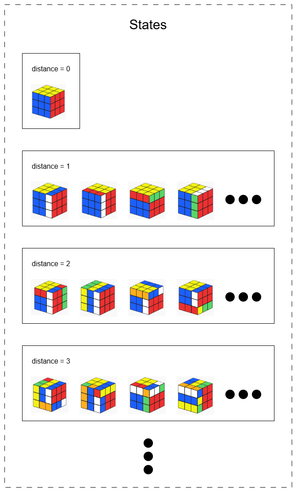

> ⚠️ **Work in Progress**  
> This project is still under active development. Some features may be incomplete or non-functional, and the documentation may not reflect the most recent changes.

---

# Heuristic Model A* Puzzle Solver

A machine learning–augmented puzzle solver that learns how to solve any* puzzle by training a heuristic function from the final state alone.

---

## 🧩 Overview

This project presents an **experimental puzzle solver** that combines machine learning and A* search to solve puzzles with minimum knowledge of the puzzle mechanics.

The key idea is for the Puzzle Solver to learn by exploring any puzzle's state space, starting from the known final state and using only the available set of valid movements. Then, the puzzle knowledge gained by exploring the state space will be used alongside the A* search algorithm to solve new, unseen configurations.

---

## 🚦 Supported Puzzle Requirements

To be solvable by this system, a puzzle must satisfy the following constraints:

* ✅ A single, unique final (solved) state.
* ✅ A finite and known set of valid movements.
* ✅ Each movement must be **reversible**, i.e., for every move `m` there exists an inverse `m'` such that: `m'(m(s)) = s`

---

## ⚙️ How It Works
The Puzzle Solver architecture can be divided in two stages: the Learning Stage and the Solving Stage. The first step in the Learning Stage is the States Generation, where the Puzzle Solver takes as input the Puzzle definition (final stage and valid momvents) and some generation restrictions (max depth and max level size) and it starts exploring the state space starting from the final state and moving level by level with the available movements (level = distance to the final state), the output is a list of pairs (state, distance_to_final_state). Then, the next step in the Learning Stage is the Model Training, here a Machine Learning Model is trained to predict the distance of any unsolved state to the final state. Finally, in the Solving Stage, the trained Model is used as Heuristic in the A* alogrithm to efficiently find solutions to any unsolved state.

Throughout the documentation, the Rubik's Cube will be used as example, but all steps can be adapted to different puzzles. Images generated with https://rubiks-cube-solver.com/.


### 1. State Generation
Starting from the final (solved) state, the system generates a subset of all the valid states by applying all valid moves to each known state, keeping track of how many steps away each state is from the goal. The output will be a list of pairs (state, distance). Along with the puzzle definition (containing the final state and valid movements) some generation restrictions are used as input to restrict the state space exploration, which is indispensable when learning to solve puzzles that have a very large amount of possible states, like the Rubik's Cube. These restrictions are max_depth and max_level_size. max_depth defines how far from the final state should the Puzzle Solver explore and max_level_size defines how many states should be explored for each level.

The next image ilustrates the State Generation process for a generic puzzle with a given final_state, \[m_0, m_1\] as the available movements, max_depth = 4 and max_level_size = 6.


Notice that in level 3 (distance = 3) the two leftmost states are excluded, as max_level_size indicates that only 6 states per level should be included (not necessarily the first 6) and there are 8 states in level 3. Then, once reached level 4 and selected up to 6 states for that level, the State Generation process stop.

The next image pictures what the State Generation output would look like applied to the Rubik's Cube.



It's important to note that if the States Generation process doesn't explore every state in the state space it's possible that a state skipped in a level near the final state is found later and considered to be further away than it actually is, producing inaccurate data for the Model Training step and potentially degrading the performance of the Puzzle Solver. For that reason, the Puzzle interface (that any puzzle should implement) defines an abstract function `is_redundant(prev_movements, movement)` that allows the Puzzle Solver to avoid movements that would reduce the distance to the final state instead of incrementing it. A correct and robust implementation of this function can be challenging and require strong knowledge of the puzzle, but nevertheless a simple implementation can also help get a cleaner and more accurate states dataset.

### 2. Model Training
In this step a machine learning model is trained, using the output from the previous step, to predict the number of movements from any state to the final state. The model selection and configuration along with the evaluation is crucial to produce an effective and efficient Puzzle Solver. During testing XGBoost, MLP and CNN models were mainly used to predict distances from any state to the final state. Also some dummy models were implemented for quick testing and comparison, including BFSModel (always returns 0, making the A* algorithm equivalent to BFS search), RandomModel (returns a random value) and RandomNormalModel (returns a random normally distributed value).


### 3. A* Search:
When solving a new puzzle configuration, the trained model is used as the heuristic function (`h(n)`) for A*, guiding the search efficiently.

---

## 🚀 Puzzle Solver in action
TODO: write about the tests performed with different puzzles and different models and the Puzzle Solver performance.

---

## 🗂️ Project Structure

```
project-root/
├── models/                  # Model classes: MLP, XGBoost, CNN, etc.
│   └── model_interface.py   # Interface for all heuristic models
├── puzzles/                 # Puzzle definitions (e.g., Rubik's Cube)
│   └── puzzle_interface.py  # Interface for all puzzles
├── puzzle_solver.py         # Core state generation and A* solver logic
├── tests.py                 # Test scripts for training and solving
├── requirements.txt         # Python dependencies
└── README.md                # Project documentation
```

---

## ▶️ How to Run

1. **Clone the repo**

   ```bash
   git clone https://github.com/mjuan99/PuzzleSolver.git
   cd PuzzleSolver
   ```

2. **Create and activate a virtual environment**

   ```bash
   python -m venv venv
   source venv/bin/activate  # On Windows: venv\Scripts\activate
   ```

3. **Install dependencies**

   ```bash
   pip install -r requirements.txt
   ```

4. **Run test script**

   ```bash
   python tests.py
   ```

---

## 🛠️ Main Technologies Used

* Python
* PyTorch
* Scikit-learn
* NumPy

---

## 🚧 Limitations

While the Puzzle Solver is designed to be general-purpose and adaptable to a wide range of puzzles, its performance heavily depends on the quality of the trained heuristic model. The effectiveness and efficiency of the solver are directly influenced by the choice of model architecture, the quality and representativeness of the training data, and the tuning of model parameters. As such, selecting and training the right model is the most critical factor in achieving strong performance when solving a particular puzzle. 

In addition, the state generation process—used to create the dataset for training the heuristic model—relies on backward exploration from the solved state. Without strong domain knowledge of the puzzle (such as understanding the true maximum distance from the solved state or identifying non-obvious "backward" moves that reduce that distance), the generation process may introduce inaccuracies. These inaccuracies could lead to noisy or misleading training data, which may negatively impact the learned heuristic and ultimately degrade the solver’s performance—sometimes negligibly, but potentially significantly depending on the puzzle.

Finally, the solution found by the Puzzle Solver may not be optimal (i.e., it may involve more moves than the minimum required). This happens because the learned heuristic function is not guaranteed to be **admissible** — it may overestimate the true cost to the goal. As a result, the A* search might not always find the shortest possible path.

---

## 📄 License

This project is open-source and available under the MIT License.

---
